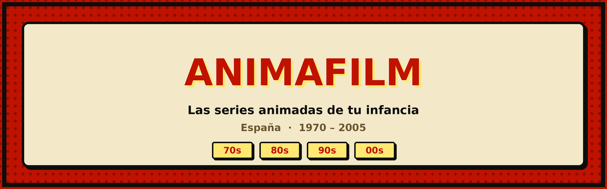

<p align="center">
  
</p>

<p align="center">
  <a href="https://animafilm.vercel.app"><strong>animafilm.vercel.app</strong></a>
</p>

<p align="center">
  
  
  
  
</p>

---

Un Letterboxd para las series animadas que marcaron la infancia en España,
de los años 70 a los 2000. Puntúa, reseña y recuerda Heidi, David el gnomo,
Bola de Dragón, Shin Chan o Los Lunnis.

## Capturas

<p align="center">
  
  
</p>

---

## Qué hace

- **Catálogo** de 30 series con búsqueda por título, cadena o género, filtros
  por década y género, y ordenación por año, nota, popularidad o alfabético.
  Los filtros viven en la URL: un catálogo filtrado se puede compartir.
- **Valoraciones** de 1 a 5 estrellas, con nota media de la comunidad
  calculada en el servidor.
- **Listas** de series vistas y pendientes, sincronizadas entre dispositivos.
- **Reseñas** escritas, editables y borrables.
- **Compartir series** con menú nativo en móvil y portapapeles en escritorio.
- **Feed** con la actividad reciente de toda la comunidad.
- **Perfil** con estadísticas y progreso por década.
- **Inicio de sesión con Google** o con email y contraseña.
- **Gestión de cuenta**: editar perfil, exportar tus datos en JSON y borrar
  la cuenta (RGPD).
- **Modo claro y oscuro**, con estética de tebeo español de los 80.

---

## Stack

| Capa | Tecnología |
|---|---|
| Frontend | React 19 + Vite 8 |
| Enrutado | React Router 7 |
| Backend | Supabase (PostgreSQL + Auth) |
| Estilos | CSS con variables, sin framework |
| Pósters | TMDB API |
| Despliegue | Vercel |

---

## Puesta en marcha

### Requisitos

- Node.js 18 o superior
- Una cuenta de [Supabase](https://supabase.com) (gratuita)
- Una clave de API de [TMDB](https://www.themoviedb.org/settings/api) (gratuita)

### 1. Instalar

```bash
git clone https://github.com/Danielon28/animafilm.git
cd animafilm
npm install
```

### 2. Variables de entorno

Crea un archivo `.env` en la raíz:

```env
VITE_SUPABASE_URL=https://XXXXXXXX.supabase.co
VITE_SUPABASE_ANON_KEY=eyJhbGciOi...
VITE_TMDB_API_KEY=tu_clave_de_tmdb
```

> La `anon key` es pública por diseño: viaja en el bundle del navegador.
> El acceso a los datos lo protegen las políticas RLS de PostgreSQL, no
> el secreto de esa clave.

### 3. Base de datos

En el **SQL Editor** de Supabase, ejecuta los archivos de `supabase/` en orden:

```
01-schema.sql              Tablas, RLS y trigger de perfiles
02-security-hardening.sql  search_path, constraints, límites anti-spam
03-migracion-catalogo.sql  Tabla `series` + vista de estadísticas
04-cuenta-y-perfil.sql     Borrado de cuenta y validación de perfil
```

### 4. Pósters

Se descargan de TMDB una sola vez y se guardan en la base de datos:

```bash
node scripts/fetch-posters.mjs > posters.sql
```

Pega el resultado en el SQL Editor.

### 5. Configurar la autenticación

En Supabase → **Authentication → URL Configuration**:

- **Site URL**: la URL de producción
- **Redirect URLs**: esa misma y `http://localhost:5173`

<details>
<summary><strong>Inicio de sesión con Google</strong></summary>

<br>

En [Google Cloud Console](https://console.cloud.google.com):

1. Nuevo proyecto → **Pantalla de consentimiento OAuth** (tipo Externo)
2. **Credenciales → ID de cliente de OAuth → Aplicación web**
3. Orígenes de JavaScript: tu dominio y `http://localhost:5173`
4. URI de redirección: `https://TU-PROYECTO.supabase.co/auth/v1/callback`

En Supabase → **Authentication → Providers → Google**: activar y pegar el
Client ID y el Client Secret.

> La URI de redirección apunta a **Supabase**, no a tu web. El flujo es:
> tu web → Google → Supabase → tu web. Es donde falla casi todo el mundo.

</details>

### 6. Arrancar

```bash
npm run dev
```

---

## Estructura

```
src/
├── App.jsx                   Componente principal, rutas y estado
├── main.jsx                  Punto de entrada
├── index.css                 Sistema de diseño completo
├── components/
│   ├── Auth.jsx              Registro, login y OAuth con Google
│   ├── GestionCuenta.jsx     Editar perfil, exportar y borrar cuenta
│   └── Portal.jsx            Modales fuera del árbol del DOM
└── lib/
    ├── supabase.js           Cliente de Supabase
    ├── series.js             Catálogo y estadísticas, con caché
    ├── slug.js               URLs legibles por serie
    ├── theme.jsx             Tema claro/oscuro vía data-theme
    ├── useThemeToggle.js     Hook del interruptor de tema
    ├── useModal.js           Foco atrapado, Escape y bloqueo de scroll
    └── toast.jsx             Avisos flotantes
```

---

## Decisiones de diseño

Algunas cosas están hechas de forma poco obvia, y hay motivos:

**El tema no vive en el estado de React.** Se aplica con un atributo
`data-theme` en el `<html>` y un evento del navegador. Con `useState` el
cambio re-renderizaba el árbol entero y se notaba el tirón.

**Los modales usan portales.** Cualquier ancestro con `transform` crea un
*containing block* y rompe el `position: fixed`. Las animaciones de entrada
dejan un transform aplicado, así que el velo del modal quedaba recortado al
área del contenido en lugar de cubrir la pantalla.

**Las escrituras son optimistas con reversión.** El cambio se pinta al
instante y, si la petición falla, se deshace y aparece un aviso. Antes se
aplicaba pasara lo que pasara: la estrella quedaba marcada aunque no se
hubiera guardado nada.

**Los filtros viven en la URL.**
Un catálogo filtrado es un enlace compartible, el botón atrás deshace el
último filtro, y la URL limpia sigue siendo `/` porque solo se escriben los
parámetros que se apartan del valor por defecto.

**El catálogo está en la base de datos, no en el código.** Así `serie_id`
puede ser una clave foránea real, se puede calcular la nota media de la
comunidad, y añadir series no requiere desplegar.

**Las fuentes se cargan desde JavaScript.** Un `<link>` normal bloquea el
primer pintado. El truco de `media="print"` necesita un `onload` inline, que
la Content-Security-Policy prohíbe, así que va en un script externo.

---

## Seguridad

- **Row Level Security** en las seis tablas: cualquiera lee, solo el
  propietario escribe.
- **Funciones `SECURITY DEFINER` con `search_path` fijo**, para evitar
  *search path hijacking*.
- **Validación en la base de datos**, no solo en el navegador: la anon key
  es pública y cualquiera puede llamar a la API directamente.
- **Límites de escritura por hora** aplicados con triggers.
- **CSP y cabeceras de seguridad** definidas en `vercel.json`.

---

## Calidad

Lighthouse sobre producción, en emulación móvil:

| Métrica | Puntuación |
|---|---|
| Accesibilidad | 100 |
| Buenas prácticas | 100 |
| SEO | 100 |
| Rendimiento | 85 |

Navegable por completo con teclado, con foco atrapado en los modales,
etiquetas descriptivas y contraste verificado en ambos temas.

---

## Pendiente

- [ ] Perfiles públicos y seguir a otros usuarios
- [ ] Listas personalizadas
- [ ] Recomendador basado en valoraciones
- [ ] Ampliar el catálogo más allá de las 30 series iniciales

---

## Autor

**Daniel Redondo Nofre** — [GitHub](https://github.com/Danielon28)

Proyecto personal. Los datos de las series y los pósters provienen de
[TMDB](https://www.themoviedb.org); este producto usa su API pero no está
avalado ni certificado por TMDB.
