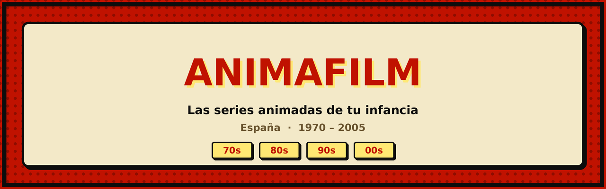

<p align="center">
  
</p>

<p align="center">
  <a href="https://animafilm.vercel.app"><strong>animafilm.vercel.app</strong></a>
</p>

<p align="center">
  
  
  
  
  
</p>

---

Un Letterboxd para las series animadas que marcaron la infancia en España,
de los años 70 a los 2000. Puntúa, reseña, lleva el diario de lo que ves y
recuerda Heidi, David el gnomo, Bola de Dragón, Shin Chan o Los Lunnis.

## Capturas

<p align="center">
  
  
</p>

---

## Qué hace

**Catálogo**
Búsqueda por título, título internacional, cadena o género. Filtros por
década y género, y ordenación por año, nota de la comunidad, popularidad o
alfabético. Todos los filtros viven en la URL, así que un catálogo filtrado
se puede compartir o guardar en marcadores.

**Valoraciones**
Estrellas de media en media, de 0,5 a 5. Cada serie muestra la nota media de
la comunidad y un histograma con el reparto de votos: no es lo mismo un 3 de
media porque todos puntúan 3 que porque la mitad da 5 y la otra mitad 1.

**Diario de visionado**
Registrar *cuándo* viste cada serie, no solo que la viste. Admite
revisionados, notas por sesión y se muestra agrupado por meses.

**Reseñas**
Escritas, editables y con marca de spoiler, que las oculta hasta que el
lector decide revelarlas. Se pueden dar "me gusta" y responder en hilo. Las
de quienes sigues aparecen destacadas aparte del resto.

**Comunidad**
Perfiles públicos, seguir usuarios, feed con ámbito general o solo de tus
seguidos, buscador de usuarios y comparación de colecciones con porcentaje
de afinidad basado en las notas que ambos habéis puesto.

**Listas**
Públicas o privadas, con su propia página y visibles desde los perfiles.

**Perfil**
Avatar con emoji y color, cuatro series destacadas, doce insignias
automáticas deducidas de la actividad, y progreso por década.

**Estadísticas**
Cifras globales, desglose por década y rankings de mejor valoradas y más
vistas, con un mínimo de tres votos para entrar en el ranking por nota.

**Cuentas**
Inicio de sesión con Google o con email. Perfil editable, exportación de
datos en JSON y borrado de cuenta (RGPD).

---

## Stack

| Capa | Tecnología |
|---|---|
| Frontend | React 19 + Vite 8 |
| Enrutado | React Router 7 |
| Backend | Supabase (PostgreSQL + Auth + RLS) |
| Estilos | CSS con variables, sin framework |
| Pósters | TMDB API |
| Despliegue | Vercel |

---

## Puesta en marcha

### Requisitos

- Node.js 18 o superior
- Una cuenta de [Supabase](https://supabase.com) (gratuita)
- Una clave de [TMDB](https://www.themoviedb.org/settings/api) (gratuita)

### 1. Instalar

```bash
git clone https://github.com/Danielon28/animafilm.git
cd animafilm
npm install
```

### 2. Variables de entorno

Crea un `.env` en la raíz:

```env
VITE_SUPABASE_URL=https://XXXXXXXX.supabase.co
VITE_SUPABASE_ANON_KEY=eyJhbGciOi...
VITE_TMDB_API_KEY=tu_clave_de_tmdb
```

> La `anon key` es pública por diseño: viaja en el bundle del navegador.
> El acceso a los datos lo protegen las políticas RLS de PostgreSQL, no el
> secreto de esa clave.

### 3. Base de datos

En el **SQL Editor** de Supabase, ejecuta los archivos de `supabase/` en
orden numérico. Cada uno es idempotente: se puede reejecutar sin romper nada.

| Archivo | Qué hace |
|---|---|
| `01-schema.sql` | Tablas base, RLS y trigger de perfiles |
| `02-security-hardening.sql` | `search_path`, constraints y límites anti-spam |
| `03-migracion-catalogo.sql` | Tabla `series` y vista de estadísticas |
| `04-cuenta-y-perfil.sql` | Borrado de cuenta y validación de perfil |
| `05-social.sql` | Perfiles públicos, seguidores y comparación |
| `06-listas-y-stats.sql` | Listas personalizadas y estadísticas globales |
| `07-personalizacion.sql` | Avatar propio y series favoritas |
| `08-fondo-perfil.sql` | *(retirado en el 09, se conserva por historial)* |
| `09-retirar-banner-y-fondo.sql` | Deshace el 08 |
| `10-media-estrella.sql` | Escala de valoración a medias estrellas |
| `11-me-gusta-resenas.sql` | "Me gusta" en reseñas |
| `12-diario.sql` | Diario de visionado |
| `13-comentarios.sql` | Comentarios en reseñas |
| `14-ficha-serie.sql` | Histograma de notas y marca de spoiler |

### 4. Pósters

Se descargan de TMDB una sola vez y se guardan en la base de datos:

```bash
node scripts/fetch-posters.mjs > posters.sql
```

Pega el resultado en el SQL Editor.

### 5. Autenticación

**Authentication → URL Configuration**

- *Site URL*: la URL de producción
- *Redirect URLs*: esa misma y `http://localhost:5173`

<details>
<summary><strong>Inicio de sesión con Google</strong></summary>

<br>

En [Google Cloud Console](https://console.cloud.google.com):

1. Nuevo proyecto → **Pantalla de consentimiento OAuth** (tipo Externo)
2. **Credenciales → ID de cliente de OAuth → Aplicación web**
3. Orígenes de JavaScript: tu dominio y `http://localhost:5173`
4. URI de redirección: `https://TU-PROYECTO.supabase.co/auth/v1/callback`

En Supabase → **Authentication → Providers → Google**: activar y pegar el
Client ID y el Client Secret.

> La URI de redirección apunta a **Supabase**, no a tu web. El flujo es:
> tu web → Google → Supabase → tu web. Es donde falla casi todo el mundo.

</details>

### 6. Arrancar

```bash
npm run dev
```

---

## Estructura

```
src/
├── App.jsx                   Rutas, catálogo y ficha de serie
├── main.jsx                  Punto de entrada
├── index.css                 Sistema de diseño completo
├── components/
│   ├── Auth.jsx              Registro, login y OAuth con Google
│   ├── Avatar.jsx            Avatar con emoji y color
│   ├── Comentarios.jsx       Hilos de respuesta en reseñas
│   ├── Diario.jsx            Apuntar visionados y ver el diario
│   ├── Distribucion.jsx      Histograma del reparto de notas
│   ├── ErrorBoundary.jsx     Evita pantallas en blanco
│   ├── Esqueletos.jsx        Cargas con la forma de cada página
│   ├── Estadisticas.jsx      Cifras globales y rankings
│   ├── Estrellas.jsx         Valoración con media estrella (SVG)
│   ├── GestionCuenta.jsx     Editar perfil, exportar y borrar cuenta
│   ├── Listas.jsx            Listas personalizadas
│   ├── PerfilPublico.jsx     Perfil de usuario
│   ├── Personalizar.jsx      Avatar y series favoritas
│   └── Portal.jsx            Modales fuera del árbol del DOM
└── lib/
    ├── diario.js             Visionados
    ├── eventos.js            Invalidación entre componentes
    ├── insignias.js          Insignias deducidas de la actividad
    ├── listas.js             Listas y estadísticas
    ├── resenas.js            Reseñas, me gusta y comentarios
    ├── series.js             Catálogo, con caché local
    ├── slug.js               URLs legibles por serie
    ├── social.js             Perfiles, seguidores y comparación
    ├── supabase.js           Cliente de Supabase
    ├── theme.jsx             Tema claro/oscuro vía data-theme
    ├── toast.jsx             Avisos flotantes
    ├── useModal.js           Foco atrapado, Escape y bloqueo de scroll
    └── useThemeToggle.js     Hook del interruptor de tema
```

---

## Decisiones de diseño

Algunas cosas están resueltas de forma poco obvia, y hay motivos:

**Las notas se guardan como enteros, no decimales.**
La escala visible es 0,5–5, pero la columna almacena medias estrellas de 1 a
10. Los decimales en SQL arrastran errores de redondeo al promediar, y un
`4.5` guardado como `4.4999997` acabaría mostrándose mal.

**Las estrellas son SVG, no el glifo ★.**
La fuente no centra ese carácter en su caja, así que recortarlo al 50 % de
ancho no cae en el eje y la media estrella queda descuadrada. Con un path
propio el corte es exacto.

**El diario guarda la fecha del visionado, no la del registro.**
`vista_el` es *cuándo lo viste*, no *cuándo pulsaste el botón*. Eso permite
anotar algo de la semana pasada, y es lo que convierte un registro de clics
en un diario.

**`watched` se conserva y se sincroniza sola.**
El diario podría sustituirla, pero sigue siendo la respuesta rápida a "¿la
he visto?". Dos triggers la mantienen al día, así que las dos tablas nunca
se contradicen sin que el cliente tenga que acordarse de tocar ambas.

**Las escrituras son optimistas con reversión.**
El cambio se pinta al instante y, si la petición falla, se deshace y aparece
un aviso. Antes se aplicaba pasara lo que pasara: la estrella quedaba
marcada aunque no se hubiera guardado nada, lo cual es peor que no guardar.

**Los componentes se avisan entre sí con eventos del navegador.**
Cada pantalla consultaba sus datos al montarse y ahí se quedaba: valorabas
una serie y el perfil seguía diciendo "0 vistas". Ahora quien escribe algo
lo anuncia y quien muestra datos derivados se vuelve a consultar, sin
contextos de React ni props atravesando el árbol.

**El tema no vive en el estado de React.**
Se aplica con `data-theme` en el `<html>`. Con `useState`, el cambio
re-renderizaba el árbol entero y el tirón se notaba.

**Los modales usan portales.**
Cualquier ancestro con `transform` rompe el `position: fixed`, y las
animaciones de entrada dejan uno aplicado. El velo del modal quedaba
recortado al área del contenido en lugar de cubrir la pantalla.

**Los filtros viven en la URL.**
Un catálogo filtrado es un enlace compartible y el botón atrás deshace el
último filtro. Solo se escriben los parámetros que se apartan del valor por
defecto, así la URL limpia sigue siendo `/`.

**Las fuentes se cargan desde JavaScript.**
Un `<link>` normal bloquea el primer pintado. El truco de `media="print"`
necesita un `onload` inline, que la Content-Security-Policy prohíbe.

---

## Seguridad

- **Row Level Security** en las doce tablas: cualquiera lee, solo el
  propietario escribe.
- **Funciones `SECURITY DEFINER` con `search_path` fijo**, para evitar
  *search path hijacking*.
- **Validación en la base de datos**, no solo en el navegador: la anon key
  es pública y cualquiera puede llamar a la API directamente.
- **Límites de escritura por hora** con triggers en reseñas, comentarios,
  "me gusta" y diario.
- **CSP y cabeceras de seguridad** definidas en `vercel.json`.

---

## Calidad

Lighthouse sobre producción, en emulación móvil:

| Métrica | Puntuación |
|---|---|
| Accesibilidad | **100** |
| Buenas prácticas | **100** |
| SEO | **100** |
| Rendimiento | **85** |

Navegable por completo con teclado, foco atrapado en los modales, etiquetas
descriptivas y contraste verificado en ambos temas. Diseño responsive con
navegación inferior en móvil.

---

## Pendiente

- [ ] Actividad reciente en el perfil
- [ ] Estadísticas anuales por usuario
- [ ] Listas destacadas de la comunidad
- [ ] Etiquetas libres en las reseñas
- [ ] Ampliar el catálogo más allá de las 30 series iniciales

---

## Autor

**Daniel Redondo Nofre** — [GitHub](https://github.com/Danielon28)

Proyecto personal. Los datos de las series y los pósters provienen de
[TMDB](https://www.themoviedb.org); este producto usa su API pero no está
avalado ni certificado por TMDB.
